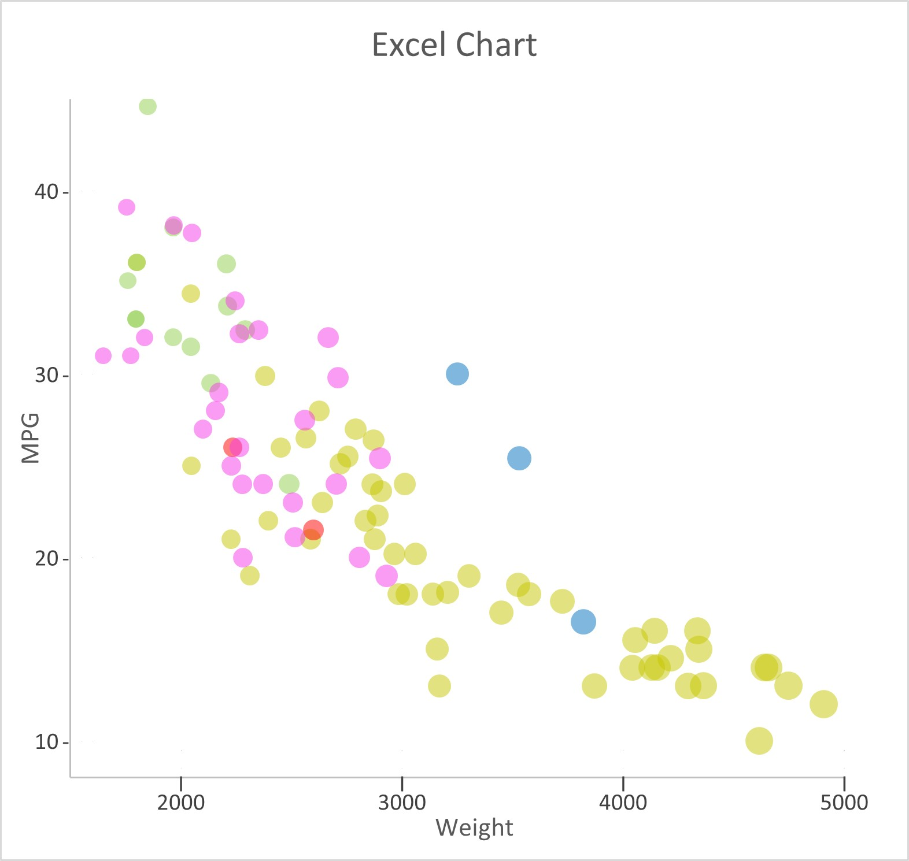
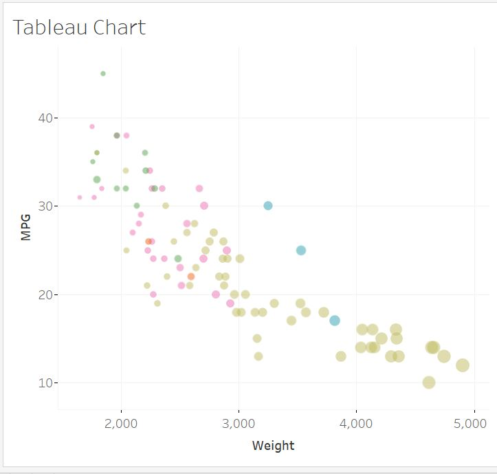
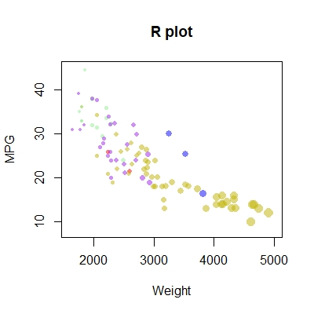
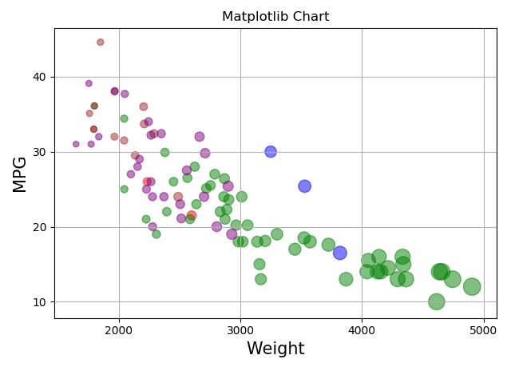
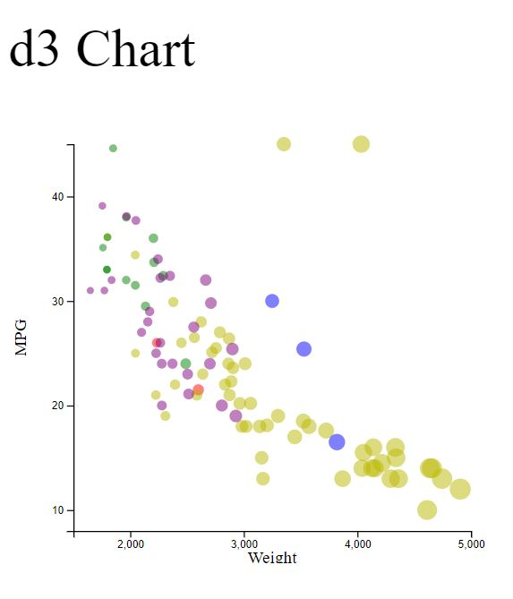

# 02-DataVis-5ways

Original chart:

These features have been preserved:

- Data positioning: downward-trending scatterplot as shown.  Weight on the x-axis and MPG on the y-axis.
- Scales: Note the scales do not start at 0.
- Axis ticks and labels: both axes are labeled and there are tick marks at 10, 20, 30, etcetera.
- Color mapping to Manufacturer.
- Size mapping to Weight.
- Opacity of circles set to 0.5 or 50%.

For the 5 charts below, there is an image of each chart in the img folder, and the code files in 
correspondingly named folders
where applicable. 

# Excel

Excel is a spreadsheet program which facilitates creating
charts from data. It's easy to create basic charts in Excel. It's a little 
harder to customize them. In order to make the size 
of points matter, I made a bubble chart
rather than a scatter chart. To specify different colors for points I
added 5 series to the chart. To make the axis ticks line up the way I wanted
them rather than with the start of the axes, I made
separate series to provide the tick labels and the ticks themselves.
I also learned that saving to a .csv file does not save the Excel chart in it. 
Practice certainly does make faster - the first time I made the chart it took me almost 3 hours; the second 
time it took about 7 minutes. 

My sources for this chart include the following: [source for using different series for colors](https://www.excelforum.com/excel-charting-and-pivots/948826-control-bubble-chart-colors-with-conditional-formatting-in-excel-2010-a.html
) and [source for creating axis ticks with a series](https://superuser.com/questions/736815/how-to-make-excel-chart-axis-start-not-at-major-unit).

# Tableau

 

Tableau is another chart-making software. Compared to Excel, using Tableau was incredibly enjoyable and intuitive. You add data; you drag and drop
columns into the axes you want them on; you right click them to see relevant menus; you double click an axis
to edit it (for example, to simply change the tickmarks...) or right-click it to format it. Size and color
of the dots each have 'cards', where you can set what data they depend on
and change their characteristics. One problem I had was that the bubble size differences didn't seem significant 
and I don't know how to change the scale, so I made another column "weight squared" and used that for bubble size. 

For Tableau sources I used the Tableau home page and [help pages](https://help.tableau.com/current/pro/desktop/en-us/viewparts_marks_marktypes.htm).

# R 

 

R is a language used for statistical analysis. It has a ton of built-in functions to make dealing with 
data and graphing very easy. I used RStudio to write an R script to make the chart. I couldn't
get the ggplot2 library to load (I think this might mean a problem with my R version or path), so
I just made the chart using normal R functions like symbols(), title(), and plot(). 

For sources, I used [this video](https://www.youtube.com/watch?v=yyXtiGCDOBo) as an intro to using R and 
making scatterplots, and these three sites
to find out about [transparency](https://stackoverflow.com/questions/12995683/any-way-to-make-plot-points-in-scatterplot-more-transparent-in-r),
 [tick mark settings and size](https://www.datacamp.com/community/tutorials/15-questions-about-r-plots#q3), 
 and [axes](https://www.statmethods.net/advgraphs/axes.html). 

# Matplotlib

 

Matplotlib is a python library that makes creating and manipulating charts easy. I also used the pandas
library to load the csv. Making the chart with matplotlib
was really easy, particularly because I looked at example code, which made it
much faster and much easier than not looking at examples. (Also *much*
faster than trying to make the Excel chart. This may be my new go-to.) 

My sources for this were a [demo of a scatterplot](https://matplotlib.org/stable/gallery/lines_bars_and_markers/scatter_demo2.html#sphx-glr-gallery-lines-bars-and-markers-scatter-demo2-py)
 and [changing colors in scatterplots](https://kanoki.org/2020/08/30/matplotlib-scatter-plot-color-by-category-in-python/)
.

# d3

 

d3 is a JavaScript library. The main trouble I had with this was accessing the 
.csv file. Not because I didn't heed the ubiquitous warnings to run a local
server, but because I kept getting CORS errors, which took me a while to see
(so the console is where the error messages go!) and fix. The fix was that I needed to change the settings on my server 
(or on the requests) to allow myself to access the file; so I changed the server
settings (in the server.py file). The other issue was understanding when I had
to call the axis tick function on the axes (before displaying them). I used example code for this one too,
so again much faster than it would have been without examples.

I used this code to fix the [no-CORS error](https://stackoverflow.com/questions/21956683/enable-access-control-on-simple-http-server), 
this code as my [starter code](https://www.d3-graph-gallery.com/graph/scatter_basic.html),
and this code to help me change the [axis ticks](https://bl.ocks.org/d3noob/23e42c8f67210ac6c678db2cd07a747e). 

# Technical achievements 
 - For technical achievements I'd say getting the tick marks in the right places on the Excel chart with the series
was pretty cool. This indicates that you could pretty much put any kind of symbol or label anywhere on an Excel
chart you want; you just have to set up a new series. If you had to add a lot of things, or commonly added
similar things, you could probably set up equations to do this faster rather than manually for a given chart. 
 - I was also happy to learn that you can make the plot with normal R functions; I'd like to fix the ggplot2 download
 error though, and see what I can do with that library.
 - Fixing the CORS error so I could access my own file was nice; I'd like to learn how to send a request
 that can get past that kind of thing. 

# Design achievements 
- Not much here; I tried to keep the sizes distinguishable and the colors similar to the original chart
(matplotlib is the farthest off). That's about it. 
